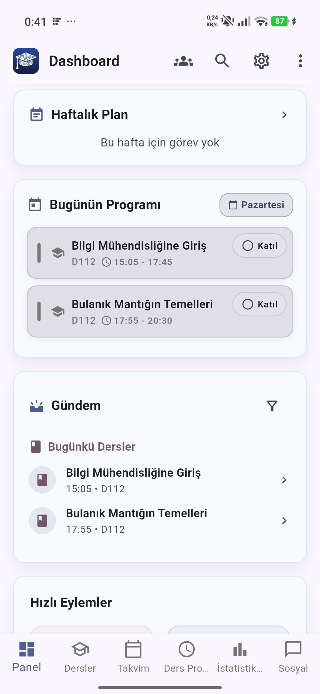
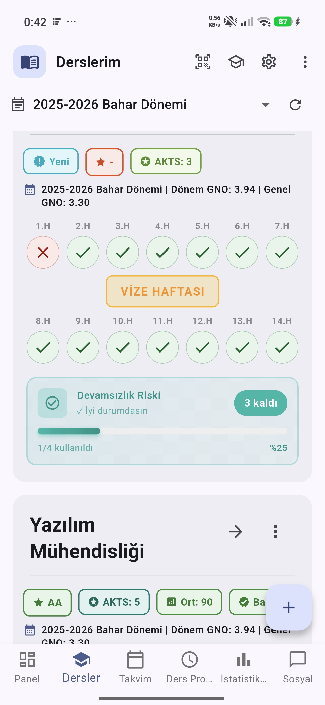
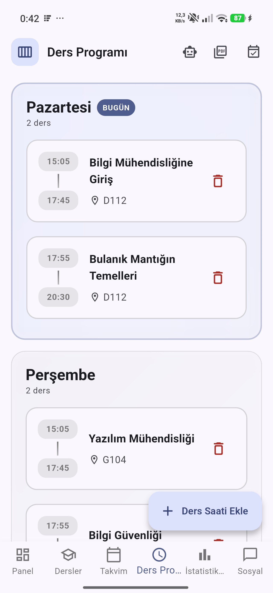
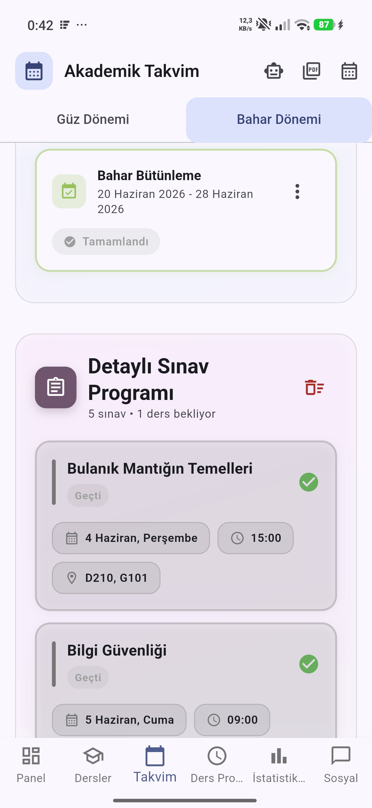
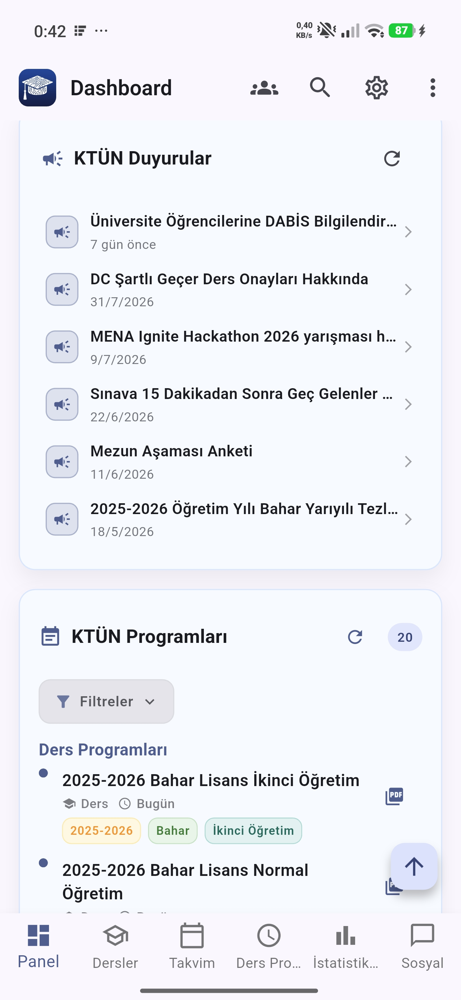

<h1 align="center">Akademik Asistan</h1>

Üniversite öğrencileri için akademik takip uygulaması.

Flutter · Android

---

## Ekran Görüntüleri

<table>
  <tr>
    <td align="center" width="33%"> Panel</td>
    <td align="center" width="33%"> Derslerim ve devamsızlık</td>
    <td align="center" width="33%"> Ders programı</td>
  </tr>
  <tr>
    <td align="center"> Sınav takvimi</td>
    <td align="center"> Duyurular</td>
    <td align="center"></td>
  </tr>
</table>

---

## Özellikler

### OBS Entegrasyonu

- Öğrenci Bilgi Sistemi'ne otomatik giriş; kullanıcı bilgileri şifreli saklanır
- Giriş ekranındaki captcha'nın otomatik çözülmesi
- Ders listesi, notlar ve devamsızlık bilgilerinin OBS'ten çekilip uygulamaya işlenmesi
- Transkript görüntüleme
- Arka planda periyodik güncelleme

### LMS Entegrasyonu

- Uzaktan eğitim sistemine otomatik giriş
- Ders sayfalarının taranması
- Ders dokümanlarının ve ödev eklerinin çekilmesi
- İçeriklerin uygulama içinden görüntülenmesi

### Ders Programı

- Haftalık program, ders saatleri ve derslikler
- Günün derslerinin panelde gösterimi
- Ders ekleme, düzenleme, silme
- Ders programı fotoğrafından otomatik okuma
- PDF ve takvim dosyası olarak dışa aktarma
- Cihaz takvimine aktarma
- Ders öncesi hatırlatma

### Sınav Takvimi

- Güz ve bahar dönemleri; vize, final ve bütünleme tarihleri
- Sınav tarihi, saati ve salon bilgisi
- Sınav takvimi görselinden tarihlerin otomatik ayrıştırılması
- Sınav öncesi kademeli hatırlatma

### Dersler ve Devamsızlık

- Dönem dersleri, AKTS ve harf notları
- Hafta hafta devamsızlık işaretleri, vize haftası ayrımı
- Kalan devamsızlık hakkı ve risk uyarısı
- Dönem ve genel ortalama
- Ders bazlı not detayı ve ortalama hesabı

### Yoklama

Yoklama üç katmanlı doğrulama ile çalışır:

- Derste ekranda dönen QR kodun okutulması
- Konum kontrolü; ders yapılan alanın dışından katılım kabul edilmez
- Bluetooth yakınlık kontrolü; öğrenci cihazının eğitmen cihazıyla eşleşmesi
- QR okunamadığında süreli manuel kod
- Katılım geçmişi

### Cihaz Güvenliği

- Root ve jailbreak tespiti
- Emülatör tespiti
- Sahte konum uygulaması tespiti
- VPN tespiti
- Şüpheli cihazda yoklamanın ve uygulamanın engellenmesi
- İhlallerin kayıt altına alınması
- Biyometrik kilit

### Duyurular ve Bildirimler

- Üniversite ve bölüm duyurularının takibi
- Yeni duyuru geldiğinde anlık bildirim
- Duyuru detayının uygulama içinde açılması
- Fakülte ders ve sınav programlarının listelenmesi
- Ders, ödev ve sınav hatırlatmaları
- Bildirim tercihleri

### Ödevler ve Planlama

- Ödev listesi, teslim tarihleri ve kalan süre
- Teslim tarihi yaklaşınca bildirim
- Haftalık plan ve görevler
- Hedef belirleme

### Çalışma Takibi

- Pomodoro sayacı, 25/5 ve 50/10 düzenleri
- Uygulama kapalıyken de çalışan zamanlayıcı
- Günlük, haftalık ve aylık istatistikler
- Akademik durum raporu

### Yapay Zeka

- Dersler ve akademik süreçler hakkında soru yanıtlayan asistan
- Görsellerden ders programı, sınav takvimi ve yemekhane menüsü çıkarımı
- Sesli yanıt

### Sohbet

- Ders bazlı sohbet kanalları
- Anlık mesajlaşma ve dosya paylaşımı
- Arkadaş ekleme ve davet

### Belgeler

- Ders notları ve PDF dosyaları için kütüphane
- Dosyaların uygulama içinde görüntülenmesi
- Kişisel not tutma

### Yemekhane

- Günlük ve haftalık menü

### Kişiselleştirme

- Açık, karanlık ve sistem teması
- Renk paletleri, saat bazlı ve mevsimsel otomatik tema
- Ana ekran widget'ları: ders programı, sınav, gündem, yemekhane
- Widget görünüm ayarları
- Genel arama: dersler, ödevler, sınavlar, belgeler ve sohbet odaları

---

## Diğer Sürüm

Web ve masaüstü sürümü: [akademik-asistan-webapp](https://github.com/csmutlu/akademik-asistan-webapp)
